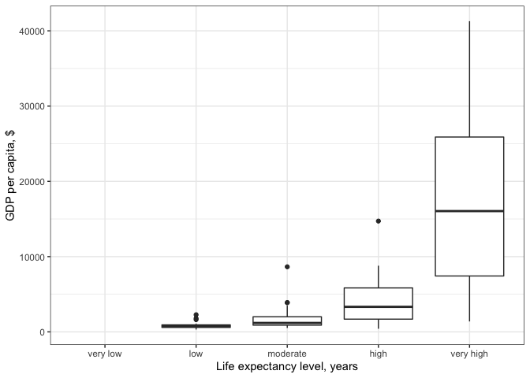
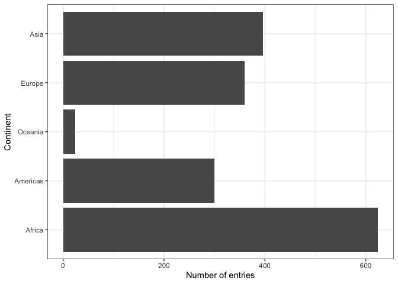
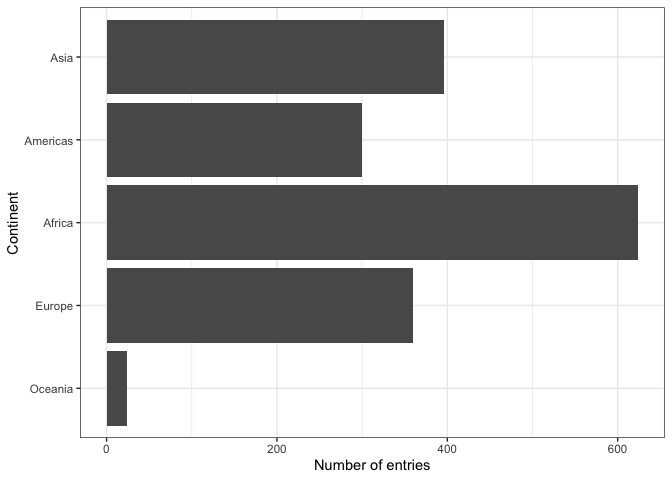
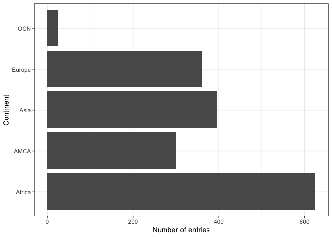

```r
library(gapminder)
library(tidyverse)
```

```
## ── Attaching packages ────────────────────────────────────────── tidyverse 1.2.1 ──
```

```
## ✔ ggplot2 3.2.1     ✔ purrr   0.3.2
## ✔ tibble  2.1.3     ✔ dplyr   0.8.3
## ✔ tidyr   1.0.0     ✔ stringr 1.4.0
## ✔ readr   1.3.1     ✔ forcats 0.4.0
```

```
## ── Conflicts ───────────────────────────────────────────── tidyverse_conflicts() ──
## ✖ dplyr::filter() masks stats::filter()
## ✖ dplyr::lag()    masks stats::lag()
```

```r
library(forcats)
library(ggplot2)
library(dplyr)
```


## Motivating the need for factors in R

### Activity 1: Using Factors for plotting 

**1.1** Let's look again into `gapminder` dataset and create a new cloumn, `life_level`, that contains five categories ("very high", "high","moderate", "low" and "very low") based on life expectancy in 1997. Assign categories accoring to the table below:

| Criteria | life_level| 
|-------------|-----------|
| less than 23 | very low |
| between 23 and 48 | low |
| between 48 and 59 | moderate |
| between 59 and 70 | high |
| more than 70 | very high |


Function `case_when()` is a tidier way to vectorise multiple `if_else()` statements. you can read more about this function [here](https://dplyr.tidyverse.org/reference/case_when.html).


```r
gapminder %>% 
  filter(year == 1997) %>% 
  mutate(life_level = case_when(lifeExp < 23 ~ "very low",  
                                lifeExp < 48 ~ "low",
                                lifeExp < 59 ~ "moderate",
                                lifeExp < 70 ~ "high",
                                TRUE ~ "very high")) %>% 
  ggplot() + geom_boxplot(aes(x = life_level, y = gdpPercap)) +
  labs(y = "GDP per capita, $", x= "Life expectancy level, years") +
  theme_bw() 
```

<!-- -->


```r
# you can also use the cut function to do the same
gapminder %>% 
  filter(year == 1997) %>%
  mutate(LIFE_LEVEL = cut(gapminder$lifeExp[gapminder$year==1997], 
                          breaks=c(0,23,48,59,70,150), 
                          labels=c("very low", "low", "moderate",
                                   "high", "very high")))
```

```
## # A tibble: 142 x 7
##    country     continent  year lifeExp       pop gdpPercap LIFE_LEVEL
##    <fct>       <fct>     <int>   <dbl>     <int>     <dbl> <fct>     
##  1 Afghanistan Asia       1997    41.8  22227415      635. low       
##  2 Albania     Europe     1997    73.0   3428038     3193. very high 
##  3 Algeria     Africa     1997    69.2  29072015     4797. high      
##  4 Angola      Africa     1997    41.0   9875024     2277. low       
##  5 Argentina   Americas   1997    73.3  36203463    10967. very high 
##  6 Australia   Oceania    1997    78.8  18565243    26998. very high 
##  7 Austria     Europe     1997    77.5   8069876    29096. very high 
##  8 Bahrain     Asia       1997    73.9    598561    20292. very high 
##  9 Bangladesh  Asia       1997    59.4 123315288      973. high      
## 10 Belgium     Europe     1997    77.5  10199787    27561. very high 
## # … with 132 more rows
```


Do you notice anything odd/wrong about the graph?

We can make a few observations:

- It seems that none of the countries had a "very low" life-expectancy in 1997. 

- However, since it was an option in our analysis it should be included in our plot. Right?

- Notice also how levels on x-axis are placed in the "wrong" order.

**1.2** You can correct these issues by explicitly setting the levels parameter in the call to `factor()`. Use, `drop = FALSE` to tell the plot not to drop unused levels 

```r
gapminder %>% 
  filter(year == 1997) %>% 
  mutate(life_level = factor(case_when(lifeExp < 23 ~ "very low",  
                                lifeExp < 48 ~ "low",
                                lifeExp < 59 ~ "moderate",
                                lifeExp < 70 ~ "high",
                                TRUE ~ "very high"), 
                             levels=c("very low", "low", "moderate", "high", "very high"))) %>% 
  ggplot() + geom_boxplot(aes(x = life_level, y = gdpPercap)) +
  labs(y = "GDP per capita, $", x= "Life expectancy level, years") +
  scale_x_discrete(drop=FALSE) +
  theme_bw() 
```

<!-- -->

```r
# the scale_x above includes the "very low" cat which had no people
```

## Inspecting factors (activity 2)

In Activity 1, we created our own factors, so now let's explore what categorical variables that we have in the `gapminder` dataset.

### Exploring `gapminder$continent` (activity 2.1)

Use functions such as `str()`, `levels()`, `nlevels()` and `class()` to answer the following questions:

- what class is  `continent`(a factor or character)?
- How many levels? What are they?
- What integer is used to represent factor "Asia"?


```r
gapminder$continent %>%
  str()
```

```
##  Factor w/ 5 levels "Africa","Americas",..: 3 3 3 3 3 3 3 3 3 3 ...
```


```r
gapminder$continent %>%
  levels()
```

```
## [1] "Africa"   "Americas" "Asia"     "Europe"   "Oceania"
```


```r
gapminder$continent %>%
  nlevels()
```

```
## [1] 5
```


```r
gapminder$continent %>%
  class()
```

```
## [1] "factor"
```


### Exploring `gapminder$country` (activity 2.2)

Let's explore what else we can do with factors:

Answer the following questions: 

- How many levels are there in `country`?
- Filter `gapminder` dataset by 5 countries of your choice. How many levels are in your filtered dataset?


```r
gapminder$country %>%
  nlevels()
```

```
## [1] 142
```

```r
n_countries = c("Canada", "Argentina", "Albania", "Haiti", "Egypt")
gap <- gapminder %>%
  filter(country %in% n_countries)

gap$country %>%
  nlevels()
```

```
## [1] 142
```

## Dropping unused levels

What if we want to get rid of some levels that are "unused" - how do we do that? 

The function `droplevels()` operates on all the factors in a data frame or on a single factor. The function `forcats::fct_drop()` operates on a factor.


```r
h_gap_dropped <- gap %>% 
  droplevels()

h_gap_dropped$country %>% 
  nlevels()
```

```
## [1] 5
```

## Changing the order of levels

Let's say we wanted to re-order the levels of a factor using a new metric - say, count().

We should first produce a frequency table as a tibble using `dplyr::count()`:


```r
gapminder %>%
  count(continent)
```

```
## # A tibble: 5 x 2
##   continent     n
##   <fct>     <int>
## 1 Africa      624
## 2 Americas    300
## 3 Asia        396
## 4 Europe      360
## 5 Oceania      24
```

The table is nice, but it would be better to visualize the data.
Factors are most useful/helpful when plotting data.
So let's first plot this:


```r
gapminder %>%
  ggplot() +
  geom_bar(aes(continent)) +
  coord_flip() +
  theme_bw() +
  ylab("Number of entries") + xlab("Continent")
```

<!-- -->

Think about how levels are normally ordered. 
It turns out that by default, R always sorts levels in alphabetical order. 
However, it is preferable to order the levels according to some principle:

  1. Frequency/count. 
  
- Make the most common level the first and so on. Function `fct_infreq()` might be useful.
- The function `fct_rev()` will sort them in the opposite order.

For instance ,
    `  

```r
gapminder %>%
  ggplot() +
  geom_bar(aes(fct_infreq(continent))) +
  coord_flip()+
  theme_bw() +
  ylab("Number of entries") + xlab("Continent")
```

<!-- -->

Section 9.6 of Jenny Bryan's [notes](https://stat545.com/factors-boss.html#reorder-factors) has some helpful examples.

  2. Another variable. 
  
  - For example, if we wanted to bring back our example of ordering `gapminder` countries by life expectancy, we can visualize the results using `fct_reorder()`. 


```r
##  default summarizing function is median(), lets order by max
gapminder %>%
  ggplot() +
  geom_bar(aes(fct_reorder(continent, lifeExp, max))) +
  coord_flip()+
  theme_bw() +
  ylab("Number of entries") + xlab("Continent") 
```

<!-- -->

Use `fct_reorder2()` when you have a line chart of a quantitative x against another quantitative y and your factor provides the color. 


```r
## order by life expectancy 
ggplot(h_gap, aes(x = year, y = lifeExp,
                  color = FILL_IN_THIS)) +
  geom_line() +
  labs(color = "country")
```

```
## Error in ggplot(h_gap, aes(x = year, y = lifeExp, color = FILL_IN_THIS)): object 'h_gap' not found
```

## Change order of the levels manually

This might be useful if you are preparing a report for say, the state of affairs in Oceania (so its first)

This puts Oceania first, then Europe, and then the remaining continents stay in the order they were in...


```r
gapminder %>%
  ggplot() +
  geom_bar(aes(fct_relevel(continent, "Oceania", "Europe"))) +
  coord_flip()+
  theme_bw() +
  ylab("Number of entries") + xlab("Continent")
```

<!-- -->
More details on reordering factor levels by hand can be found [here] https://forcats.tidyverse.org/reference/fct_relevel.html

### Recoding factors

Sometimes you want to specify what the levels of a factor should be.
For instance, if you had levels called "blk" and "brwn", you would rather they be called "Black" and "Brown" - this is called recoding.
Lets recode `Oceania` and the `Americas` in the graph above as abbreviations `OCN` and `AME` respectively using the function `fct_recode()`.


## Grow a factor (OPTIONAL)

Let’s create two data frames,`df1` and `df2` each with data from two countries, dropping unused factor levels.

__you can also relevel and then recod a variable,...using piping__

__you can also use it recode(relevel(,....)) but not a good way to do it__


```r
gapminder %>%
  ggplot() +
  geom_bar(aes(fct_recode(continent, "OCN"="Oceania", "AMCA"="Americas"))) +
  coord_flip()+
  theme_bw() +
  ylab("Number of entries") + xlab("Continent")
```

<!-- -->

The country factors in df1 and df2 have different levels.
Can we just combine them?


The country factors in `df1` and `df2` have different levels.
Can you just combine them using `c()`?


Explore how different forms of row binding work behave here, in terms of the country variable in the result.

